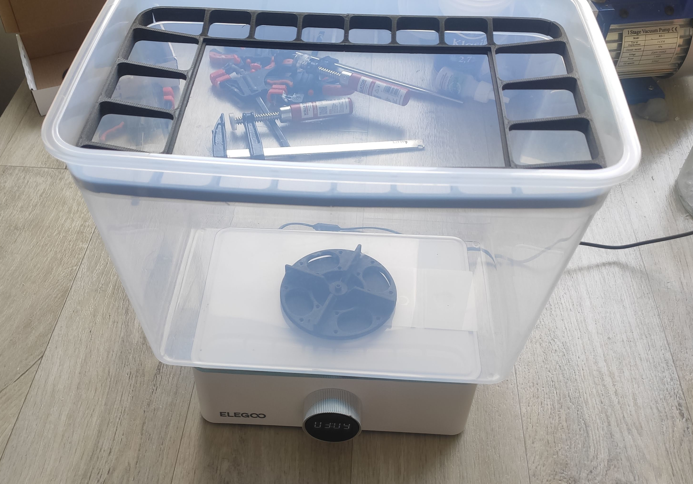
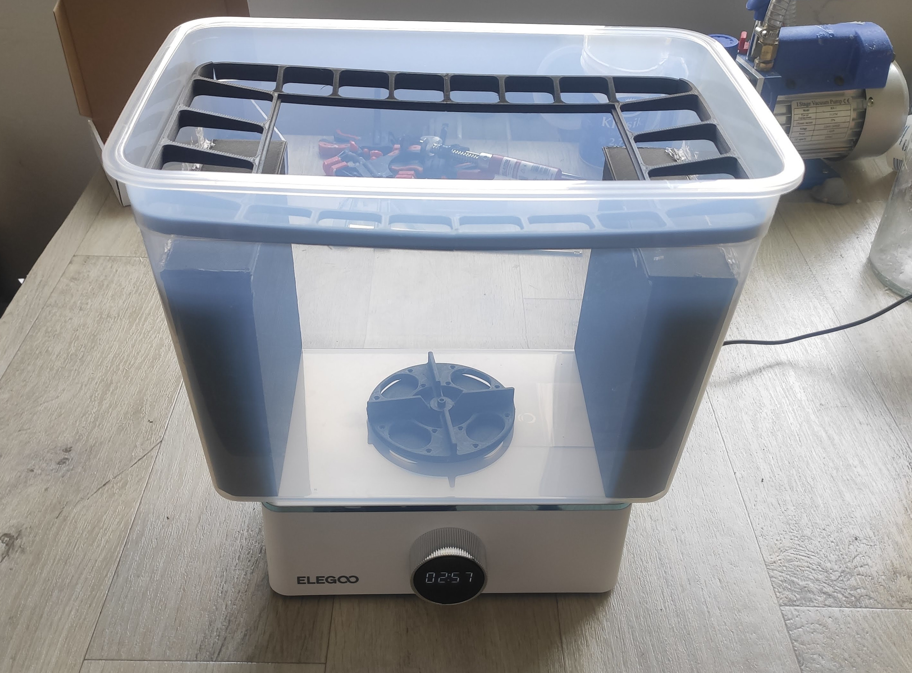

# Marcury X Upgrade

Upgrades for Elegoo Mercury X Bundle Washing and curing machine. Currently
includes:

- a second cleaning container made out of IKEA 365 food container.

Be sure to read the orignal post before building: [Hand-on experiences with
Mercury X Washing & Curing station and 15 USD must-have
upgrades](https://blog.honzamrazek.cz/2021/10/hand-on-experiences-with-mercury-x-washing-curing-station-and-15-usd-must-have-upgrades/).

# How to build?

See individual guide pages. These pages include bill of materials and step-by-step
guides for building.

- [build the extra container](guides/extraContainer.md)

