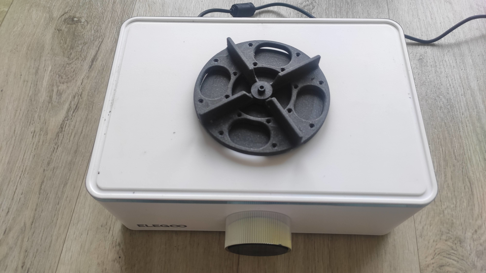
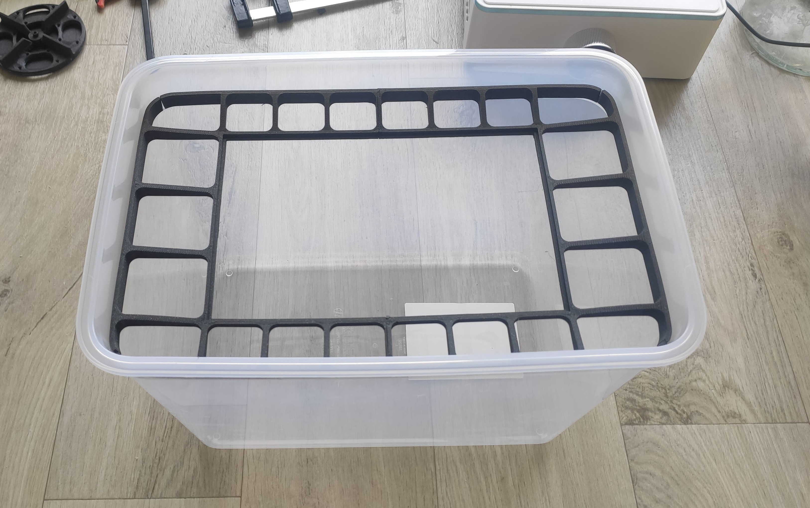
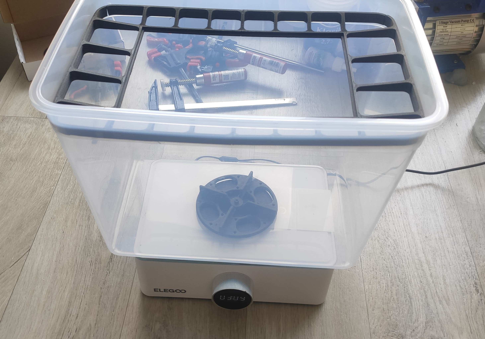

# Extra container

## Bill of materials

- 1pcs [IKEA 365+ 10.6l container](https://www.ikea.com/cz/en/p/ikea-365-food-container-with-lid-rectangular-plastic-s79276760/)
- 4pcs [20×2 mm cylindrical neodymium magnets](https://s.click.aliexpress.com/e/_ArYCDr)
- 1pcs M3 nut
- 1pcs M3x20 screw

## What to print

- 1pcs [impeller top](../models/impellerTop.step)
- 1pcs [impeller bottom](../models/impellerBottom.step)
- 1pcs [impeller hub](../models/impellerHub.step)
- 1pcs [build plate stand](../models/BuildPlateStand.step) (contains 2 bodies, print
  separately if you don't have large enough machine)
- optionally for ballast to reduce container volume:
    - 2pcs [ballast](../models/ballast.step)
    - 2pcs [ballast](../models/cover.step)

I suggest printing it out of PLA, use 100% infill and use supports for printing
to get a nice pockets for the magnets. I also advise to use 20 perimeters - it
speeds up printing significantly.

## Assembly

These are the component you should print:

Start by inserting magnets. Insert them on the machine to ensure correct
orientation (the magnet should stick to the baseplate)

Then glue the top and bottom parts of the impeller. I suggest using a super glue
or epoxy. If you want to avoid gluing, there are prepared holes for M2 screw
with countersink.

Next, let's move to the hub. Remove supports from the bottom. Now you can either
tap M3 thread into the base or enlarge the hole slightly and heat press M3 nut:

The build plate stand is designed to firmly pressed together. Once it is
assembled you can put in into the container. It should fit really tightly.

As the last step, glue the hub to the bottom of the tank. I suggest using a
5-minute epoxy. Once the glue settles, screw in the impeller using M3 screw. Do
not overtight the screw - the impeller has to spin freely.

Optionally, if you would like to reduce the volume of the tank, print ballast
containers, fill them with sand and properly glue covers. Be sure that the glued
joint is airtight!

And then glue them to the walls of the container:

